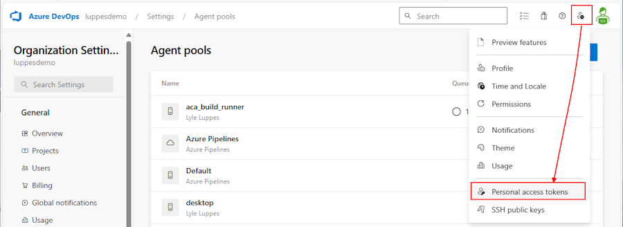
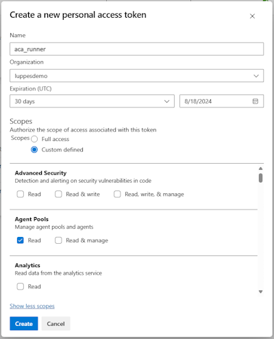
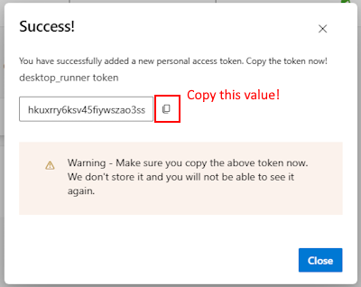
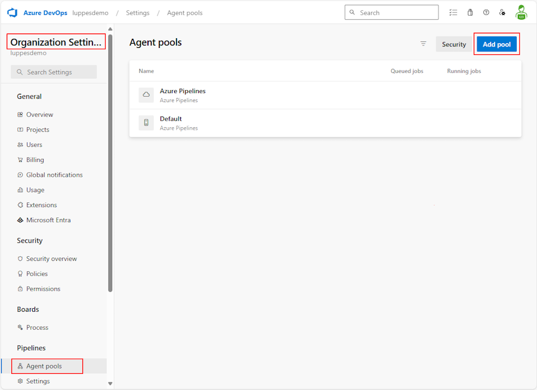
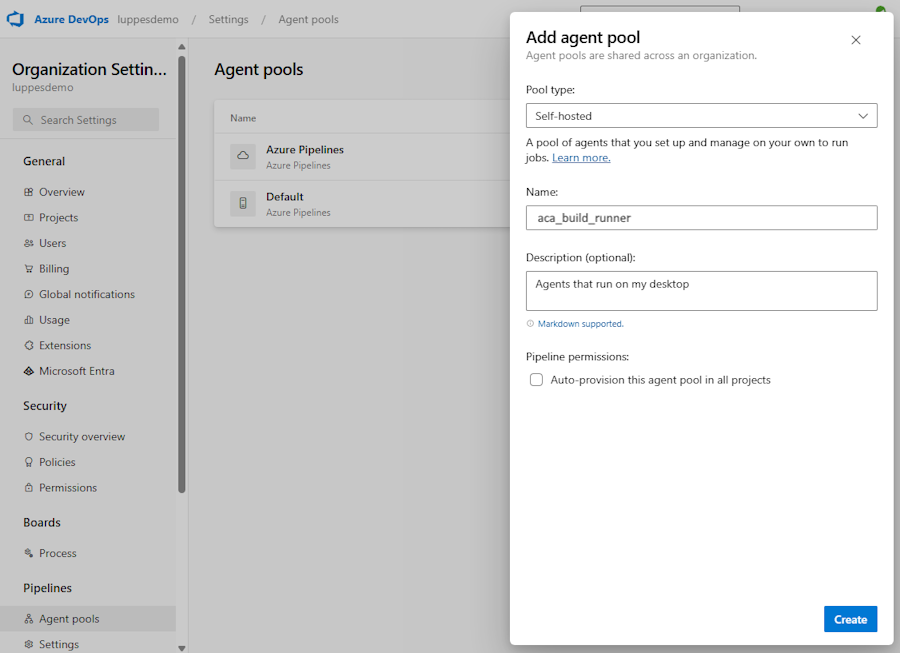
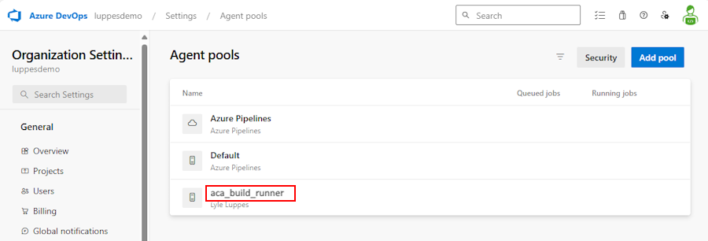

# Create a Self-Hosted Azure DevOps Container App Build Runner

This document will show you how to create a Azure Container Apps hosted Devops Build Runner.  Or, use these instructions to build an [Desktop Build Runner](../desktop-runner/README.md).

## Steps to create a Desktop Runner

1. Create a PAT Token in Azure DevOps with Agent Pool read/write permissions.
1. Create an Agent Pool to be linked to the container app
1. Create the Azure Container App environment
1. Create a Place Holder Job and Event Based Trigger Job

---

### 1. Create a PAT Token in Azure DevOps with Agent Pool read/write permissions

- Go to User Settings -> Personal Access Token -> then click on the New Token button
  

- Name the token `desktop_runner` and select your DevOps organization.  For purposes of this class, you can select `Full Access` for the scope.  Normally you would want to limit the scope to `Agent Pools (read, manage)`, `Build (read, execute)`, `Pipeline Resources (use, execute)`, `Release (read, write, execute)` and `Variable Groups (read)` or something similar, depending on what access your pipelines need.

  

- Once the token is created, be sure to copy that value off to somewhere like Notepad, as you will not be able to retrieve it again, and you will need it for the next steps

  

---

### 2. Create an Agent Pool to be linked to your Container App
  
- Go to Azure DevOps -> Organization Settings -> Pipelines: Agent Pools -> and click the Add Pool button

  

- Select Pool type of `Self-Hosted`, name the pool something like  'aca_build_runner', and uncheck `Auto-provision this agent pool in all projects`

  

- Click `Create` and you should see your new pool

  

---

### 3. Create the Azure Container App environment

- Open a PowerShell window and run the [create_aca_environment.ps1](scripts/create_aca_environment.ps1) to create the ACA environment and ACR registry.

- Come up with a 3-5 character unique identifier for your environment (your initials?) and supply that as a parameter for the script.  This will be used as a prefix to create globally unique names for the resources.

- There are other parameters that default to the values in the script, but you can override them if you want.

#### Example

``` bash
./create_aca_environment.ps1 -UniqueId 'xxx'
```

---

### 4. Create a Place Holder Job and Event Based Trigger Job

- Open a PowerShell window and run [create_containerapp_job.ps1](scripts/create_containerapp_job.ps1) to create the job.

- Your Azure Organization Name will be the second node of the URL for your Azure DevOps Organization.  For instance, if your organization is `https://dev.azure.com/mycompany`, then your organization name is `mycompany`.

- The Token in this command is the PAT token you created in step 1.

- There are other parameters that default to the values in the script, but you can override them if you want.

- **Note:** This example will use the dockerfile `Dockerfile.pipelines` in the `docker` folder (which you can override with the -DockerFile parameter).  If you need your build server to have specific utilities, copy and modify the dockerfile to include those.

  - Please note that the ACA environment currently only supports **LINUX** build servers.

#### Example Command

``` bash
./create_containerapp_job.ps1 -UniqueId 'xxx' -AzdoOrgName 'mycompany' -AzdoToken 'xxxxx'
```

---

## Reference

[Tutorial: Deploy self-hosted CI/CD runners and agents with Azure Container Apps jobs](https://learn.microsoft.com/en-us/azure/container-apps/tutorial-ci-cd-runners-jobs?tabs=bash&pivots=container-apps-jobs-self-hosted-ci-cd-azure-pipelines)
