# Create a Self-Hosted Azure DevOps Desktop Build Runner

This document will show you how to create a self-hosted Azure Devops Build Runner on a Windows Desktop.  Or, use these instructions to build an [Azure Container Apps Build Runner](../aca-runner/README.md).

## Steps to create a Desktop Runner

1. Find your Computer Name.
1. Create a PAT Token in Azure DevOps with Agent Pool read/write permissions.
1. Create an Agent Pool to be linked to your desktop.
1. Install the Agent Software
1. Run a job to test this

---

### 1. Find your Computer Name

- Open a PowerShell command prompt as administrator.  Determine your machine name by running the command `hostname`. (HostName.exe is an executable file available on your computer drive, which should be located in the C:\Windows\System32 directory)

---

### 2. Create a PAT Token in Azure DevOps with Agent Pool read/write permissions

- Go to User Settings -> Personal Access Token -> then click on the New Token button
  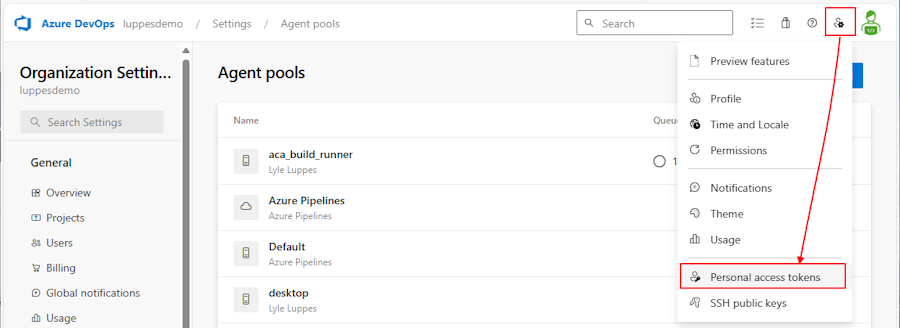

- Name the token `desktop_runner` and select your DevOps organization.  For purposes of this class, you can select `Full Access` for the scope.  Normally you would want to limit the scope to `Agent Pools (read, manage)`, `Build (read, execute)`, `Pipeline Resources (use, execute)`, `Release (read, write, execute)` and `Variable Groups (read)`, or something similar, depending on what access your pipelines need.

  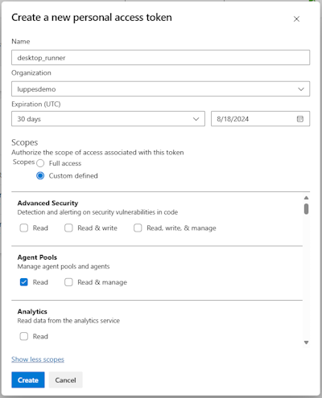

- Once the token is created, be sure to copy that value off to somewhere like Notepad, as you will not be able to retrieve it again, and you will need it for the next steps

  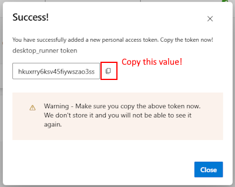

---

### 3. Create an Agent Pool to be linked to your desktop
  
- Go to Azure DevOps -> Organization Settings -> Pipelines: Agent Pools -> and click the Add Pool button
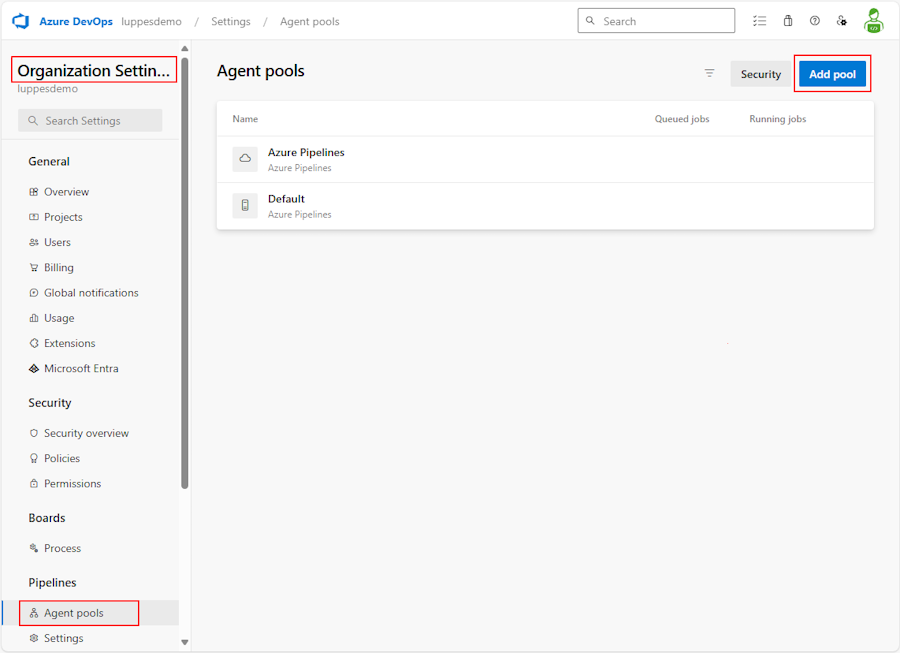

- Select Pool type of `Self-Hosted`, name the pool the same as your machine name showed by the `hostname` command above, and uncheck `Auto-provision this agent pool in all projects`
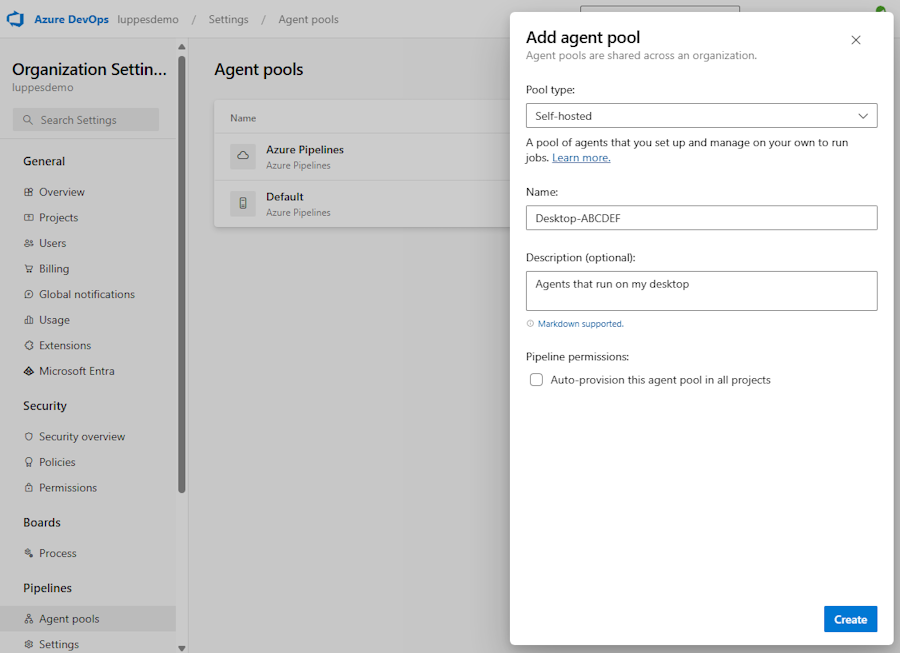

- Click `Create` and you should see your new pool
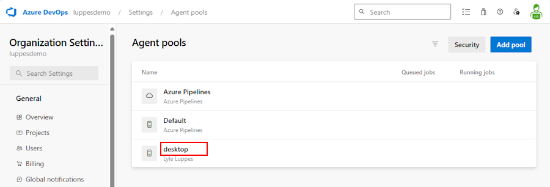

---

### 4. Install the Agent Software

- Go to your new Pool, select the Agents Tab, and then click on the `New Agent` button

  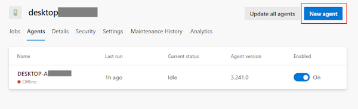

- Select Windows, x64 and Download the agent.

  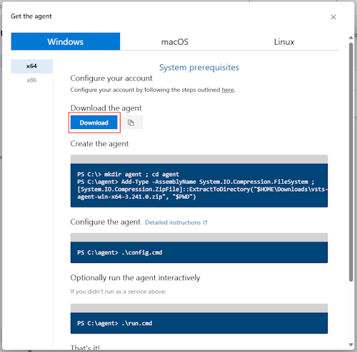

- Unzip the software into a folder of your choosing

  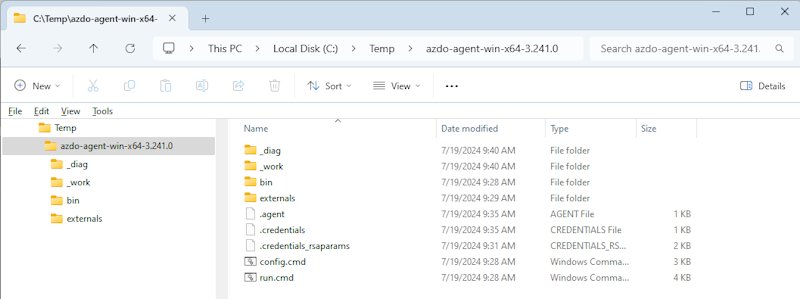

- Return to your PowerShell Administrator command prompt (or open a new prompt).
- Change to the directory where you unzipped the agent software.
- Run the command `.\config.cmd` to configure the agent.
  - Enter the URL for your Azure DevOps organization (e.g. `https://dev.azure.com/your-organization-name`)
  - Enter the PAT token you created in step 2
  - Enter the name of the agent pool you created in step 3
  - Enter the name of the agent (this should be the same as your machine name)
  - If you want this agent to only run when you start the program up (recommended for this class):
    - Enter 'N' to run as a desktop app only when you start the program up.
    - Enter 'N' for configure autologon and run agent on startup? (Y/N)
  - If you want this agent to ALWAYS be running (*recommended for a normal build agent VM*):
    - Enter `Y` to run the agent as a service (this will always be running in the background)
  
  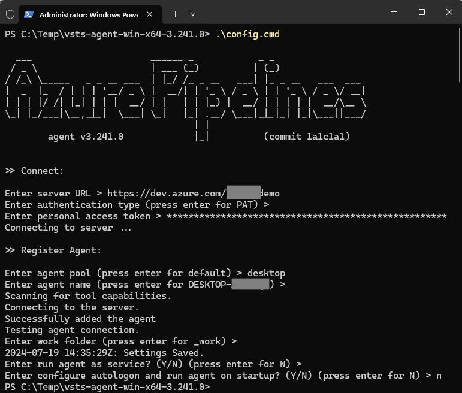

  - If you chose to only run on demand, start the server up now using the `.\run.cmd` command.  If you chose to run as a service, the service should already be running.

---

### 5. Run a job to test this

- Go to Azure DevOps -> Pipelines -> New Pipeline
- Select the repository where you have your pipeline code
- Select the `Starter Pipeline` template
- Edit the trigger to be `trigger: none` (we don't want to run this automatically)
- Edit the pool to be `pool: name: your-pool-name` (the name of the agent pool you created in step 3)
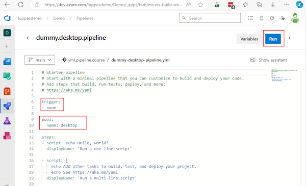
- Click the `Run` button
- You should see the job run on your desktop agent
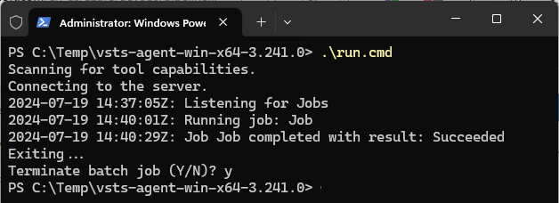

---

### Success!

That's it!  You now have a self-hosted Azure DevOps Build Runner running on your desktop! You won't have to wait in a queue behind anyone else, and you can run your builds whenever you want!

---

## Reference

[Self-hosted Windows agents](https://learn.microsoft.com/en-us/azure/devops/pipelines/agents/windows-agent?view=azure-devops)
